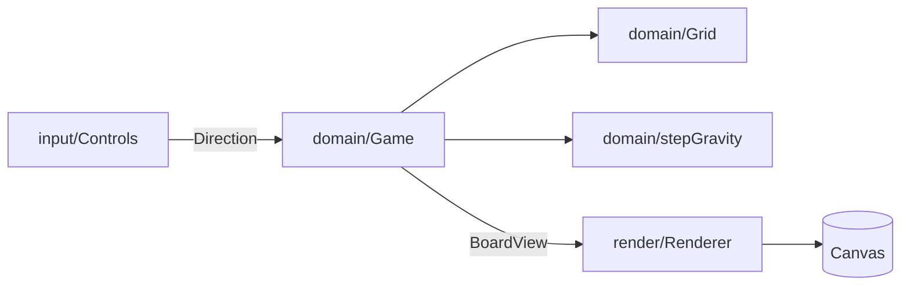

# M1: 掘り進むコア

対応 Issue: #1

「掘る → 支えを失ったブロックが落ちる → 潰される」という、ミスタードリラーの骨格を作った。
同色 4 連結の消去（M2）と空気ゲージ（M3）はまだ無い。

## できたこと

- 幅 8 マスの土を下方向へ無限生成し、深さ（m）をスコアにする
- 上下左右に掘る。左右は掘るのと入るのが 1 手
- 支えを失った塊が落ちてくる。落ちる単位は「同色でつながったひとかたまり」
- 落ちてきたブロックに潰されるとゲームオーバー
- 画面下の十字で操作。指を滑らせれば押し直さずに方向を変えられる
- GitHub Pages へ自動デプロイ

## 構成

```
src/
  domain/   ルール本体。Canvas も DOM も知らない → 単体テスト 30 件
    grid.ts      土の格納と生成
    gravity.ts   同色の塊を見つけ、支えの有無を判定して落とす
    player.ts    押した方向に何が起きるかを決める純関数
    game.ts      上を束ねて 1 フレーム進める
  render/   Canvas 2D への描画のみ。BoardView 越しにしか盤面を読めない
  input/    タッチ / キーボード → 方向
```



依存は常に外から domain へ向いていて、domain からは何も出ていかない。
描画は `BoardView` という読み取り専用の窓越しにしか盤面を見られないので、
描画のついでに盤面が変わることが型で防がれている。

## 詰まったところと、その解き方

### 落ちる単位は「セル」ではなく「塊」

1 マスずつ落とすと、同色の塊がバラバラに崩れて原作の手触りにならない。
同色 4 近傍で連結成分に分け、成分ごとに「支えられているか」を判定した。
支えは伝播する（地面に足がついた塊 → その上に乗った塊 → さらにその上）ので、
足がついた成分から幅優先で「支えられている」を配っている。

### 無限の下と、有限の計算

盤面は下へ無限に続くので、重力を全部計算するわけにいかない。
プレイヤーの上下 24 マスだけを窓として計算している。
問題は窓の外で、未生成の行は「空」と見分けがつかない。空だと決めつけると
盤面が丸ごと下へ落ちる。**窓からはみ出した塊は支えられているものとして動かさない**、
と上下対称に倒すことで解決した。

### 掘った瞬間に落ちてくると理不尽になる

最初の実装では、支えを外した瞬間にブロックが落ちてきた。
横に掘り進むと 0.6 秒でほぼ確実に潰される。実測したところ、
猶予なしでは横掘りの生存時間の中央値が 0.6 秒しかなかった。

そこで「支えを失ってから 8 ティック（約 0.7 秒）浮いてから落ちる」猶予を入れ、
その間ブロックを震わせて予告するようにした。震えが唯一の予告なので、
落下が近いほど揺れが大きくなる。

40 シードで測った生存時間（60 秒で打ち切り）:

| 押し方 | 中央値 |
|---|---|
| 下だけ | 60 秒（死なない） |
| 潜ってから右を押し続ける | 5.1 秒 |
| 潜ってから右と下を 1 秒ごとに交互 | 5.3 秒 |
| **頭上が震えたら下へ逃げる** | **60 秒（死なない）** |

震えに反応すれば助かり、頭上を崩し続ければ潰される。原作どおりの正しい死に方になった。

### 「支えられている」と「動かない」は別のこと

猶予を入れた最初の実装では、ブロックが消えるバグが出た。
`supported` という 1 つの真偽値が「接地している」と「このティックで動かない」を
兼ねていたのが原因で、猶予中で動かない塊の上に落下中の塊が重なり、
埋まっているマスへ書き込んでいた。

- **接地**: 支えがある。浮き時間がリセットされ、震えも止まる
- **停止**: このティックでは動かない。接地に加えて、猶予中のものとその上に乗っているもの

2 つを別々に求め、どちらも「真下で接している」関係を伝って上へ配るようにした。
盤面のブロックが増減しないことを回帰テストで固定してある。

## 次

M2（同色 4 連結の消去）。詳細は [PLAN.md](../PLAN.md)。
