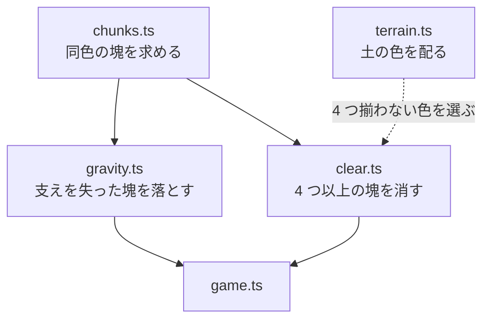

# M2: 同色 4 連結の消去と連鎖

対応 Issue: #3

掘って落として揃えると消える、というミスタードリラーの得点源を入れた。
これで「掘る → 落ちる → 消える → また落ちる」の循環が回り出す。

## できたこと

- 同じ色が 4 つ以上つながると、点滅してから消える
- 消えた跡に落ちてきたブロックがまた揃うと連鎖する
- 連鎖するほど 1 個あたりの点が上がる。深さ（m）とは別に点数を表示
- 地形は「3 個までの塊」で配られる。生成しただけでは消えない

## 構成の変化

塊を求める処理を `chunks.ts` に切り出し、落下と消去の共通部品にした。

`Grid` は「土の入れ物」に戻し、行の作り方は外から渡すようにした（`RowGenerator`）。
色の配り方は深さやルールに左右されるので、保管と同居させると M3 で破綻する。

ブロックには**混ぜてはいけない 3 つの状態**がある。M1 で 2 つを 1 つの真偽値に
兼ねさせてバグを出したので、今回は最初から分けてある。

| 状態 | 意味 |
|---|---|
| 接地 | 支えがある。浮き時間がリセットされ、震えも止まる |
| 停止 | このティックで動かない。猶予中・消去待ちとその上に乗るものを含む |
| 消去待ち | 落ちも消えもせず、点滅しながら盤面に残る |

### 消える塊は盤面の外で覚えておく

落下も消去も、プレイヤーの上下 24 マスという「窓」の中だけで計算している。
盤面は下へ無限に続くので全部は見られないし、見る必要もない。

ところが消去だけは、窓に閉じると壊れる。点滅している最中にプレイヤーが落ちると
窓がずれ、**塊の半分だけが消えて残りが宙に固まる**（消去待ちのブロックは
落ちも消えもしないので、窓が戻るまで永久に浮いたまま点滅する）。

そこで「消えると決まった塊」は `ClearOrder` として盤面の外に持ち、
一度印がついたら窓がどこにあろうと最後まで一緒に消えるようにした。
セルに持たせたカウンタは、点滅を描くための写しでしかない。

### 連鎖は「列」で追う

「盤面が静まるまでを 1 連鎖」とすると、無関係な 2 回の消去まで連鎖に数えてしまう。
掘れば必ずどこかの塊が支えを失うので、実プレイでは頻発する（実測で
独立した 2 箇所の消去が「2 CHAIN・120 点」になった。正しくは 80 点）。

消した跡の**列**を覚えておき、その列で落下が続いている間だけ連鎖とみなすようにした。
因果を完全に追うわけではないが、離れた場所の偶然を連鎖と呼ぶことはなくなる。

## 詰まったところと、その解き方

### 消えなさすぎて遊びにならなかった

最初の実装は「生成した瞬間に 4 つ揃う色は避ける」だけだった。
これだと同色が 1〜2 個ずつに散らばり、**118m 潜って 1 回も消えない**。
掘っても落としてもまず揃わないので、消去のルールがあること自体に気づけない。

原因は 2 つあった。一様な乱数で塗っていたことと、色が 5 色あったこと。
隣と同じ色を選ぶ確率（クラスタ率）を入れて 3 個の塊を作り、色数を 4 に減らした。
「あと 1 個」が至るところに生まれ、どこを崩すかを考える遊びになる。

20 シード × 60 秒の試走（頭上が震えたら逃げる操作）:

| 色数 | クラスタ率 | 点が入った | 生存 | 深さ中央値 |
|---|---|---|---|---|
| 5 | 0 | 6/20 | 11/20 | 263 |
| 5 | 0.55 | 12/20 | 8/20 | 26 |
| 4 | 0.55 | 12/20 | 12/20 | 263 |
| **4** | **0.7** | **13/20** | **13/20** | **263** |
| 4 | 0.8 | 8/20 | 13/20 | 263 |

色を固めると落ちてくる塊も大きくなるので、5 色のままクラスタ率だけ上げると
落石が凶悪になって深く潜れなくなる（深さ中央値 263 → 26）。
色数を減らして初めて、消えることと生き延びることが両立した。

### 消えるまでの点滅

即座に消すと、何がどう繋がって消えたのか目で追えない。
落下の猶予と同じく、印がついてから 6 ティック点滅させてから盤面を離れる。
点滅は時間ではなくティックで数えているので、フレームレートが落ちても回数が変わらない。

## 次

M3（空気ゲージとエアカプセル、Issue #4）。詳細は [PLAN.md](../PLAN.md)。
